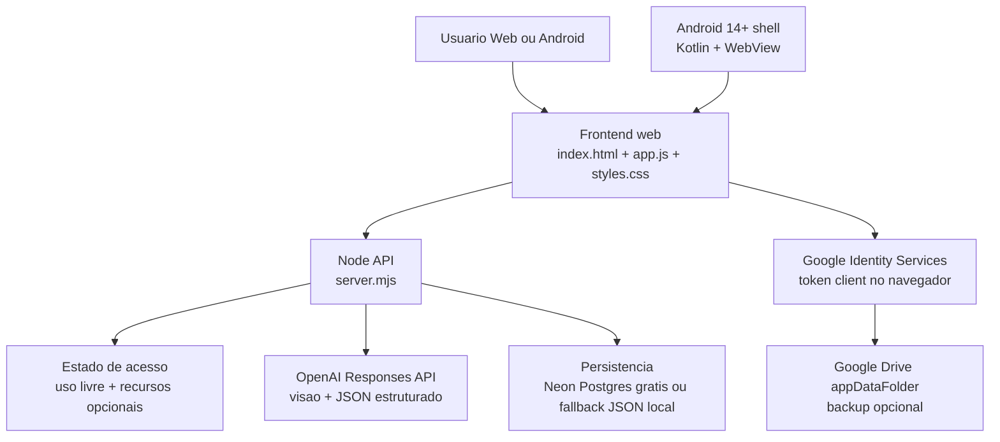

# Arquitetura

## Objetivo

Converter qualquer imagem capturada pela camera ou enviada pelo usuario em `4 interpretacoes de receita de croche`, mantendo o uso livre e oferecendo backup opcional com Google.

## Camadas

## Fluxo principal

1. O usuario captura imagem pela camera ou envia um arquivo.
2. O frontend reduz a imagem quando necessario.
3. O backend recebe a referencia e envia para a OpenAI com schema estruturado.
4. O frontend renderiza resumo visual, materiais, legenda, diagrama 12x12 e 4 estilos.
5. O ultimo resultado e salvo localmente no navegador para restauracao rapida.

## Backup Google opcional

1. O frontend recebe `GOOGLE_CLIENT_ID` pelo snapshot de acesso.
2. O usuario clica em `Conectar Google`.
3. O navegador usa `google.accounts.oauth2.initTokenClient()` para obter token de acesso.
4. O app grava ou restaura um arquivo JSON no `appDataFolder` do Google Drive.

## Android 14+

O app Android em `android/` e um shell WebView com:

- `minSdk = 34`
- `targetSdk = 34`
- permissao de camera
- cookies persistidos para sessao
- upload de arquivo
- carregamento da versao web hospedada

## Limites atuais do MVP

- Em producao gratis, o caminho recomendado e `Render Free + Neon Free`.
- O fallback local em `JSON` existe para desenvolvimento, nao para deploy publico.
- Sem fila, observabilidade nem painel administrativo.
- O backup Google depende de um `GOOGLE_CLIENT_ID` web configurado para a URL publica do app.

## Evolucao recomendada para producao

1. Sair do plano gratuito de deploy quando precisar de menos cold starts e maior estabilidade.
2. Mover arquivos estaticos para CDN ou host estatico.
3. Adicionar logs, monitoramento e rate limit.
4. Criar historico sincronizado no backend, se quiser restauracao sem depender do Drive.
5. Criar painel admin para suporte e moderacao de uso.
