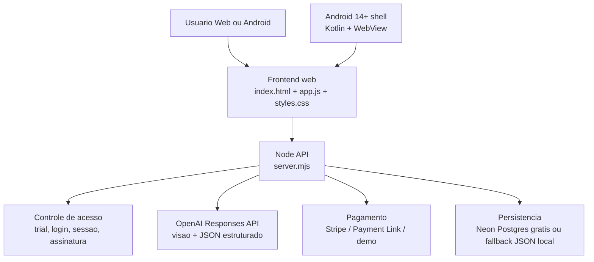

# Arquitetura

## Objetivo

Converter qualquer imagem capturada pela camera ou enviada pelo usuario em `4 interpretacoes de receita de croche`, com trial anonimo, login/cadastro apos o trial e assinatura mensal.

## Camadas

## Fluxo de acesso

1. Primeira visita cria um `trial anonimo` de `7 dias`.
2. Durante o trial, o usuario pode gerar diagramas sem cadastro.
3. Quando o trial expira:
   - o frontend bloqueia a geracao
   - exibe tela de `entrar` ou `criar conta`
4. A conta pode ser criada depois do trial.
5. Sem assinatura ativa, a conta continua bloqueada.
6. Com assinatura ativa, o acesso volta.

## Fluxo de geracao

1. Frontend captura imagem pela camera ou upload.
2. A imagem e reduzida no navegador para envio mais leve.
3. O backend valida se o usuario pode gerar.
4. O backend envia a imagem para a OpenAI com schema estruturado.
5. O frontend renderiza:
   - resumo visual
   - materiais
   - 4 estilos
   - legenda
   - diagrama 12x12
   - passo a passo

## Assinatura

- Preco mensal: `R$ 3,69`
- Trial: controlado no proprio app, nao no Stripe
- Modos suportados:
  - `stripe`: checkout hospedado
  - `payment_link`: link externo de pagamento
  - `demo`: assinatura local para testes

## Android 14+

O app Android em `android/` e um shell WebView com:

- `minSdk = 34`
- `targetSdk = 34`
- permissao de camera
- cookies persistidos para sessao
- upload de arquivo
- abertura externa de links de checkout

## Limites atuais do MVP

- Em producao gratis, o caminho recomendado e `Render Free + Neon Free`.
- O fallback local em `JSON` existe para desenvolvimento, nao para deploy publico.
- Sem fila, observabilidade nem painel administrativo.
- Para publicacao em `Google Play`, a cobranca digital do shell Android precisa migrar para `Google Play Billing`.

## Evolucao recomendada para producao

1. Sair do plano gratuito de deploy quando precisar de menos cold starts e maior estabilidade.
2. Mover arquivos estaticos para CDN ou host estatico.
3. Manter Node API em servico com HTTPS.
4. Adicionar logs, monitoramento e rate limit.
5. Criar painel admin para usuarios, assinaturas e suporte.
